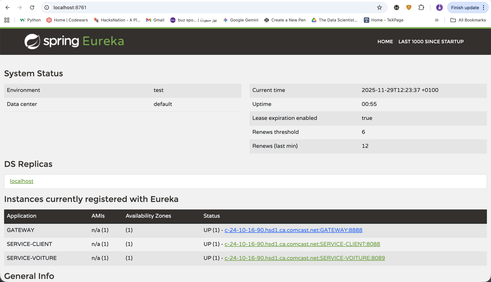
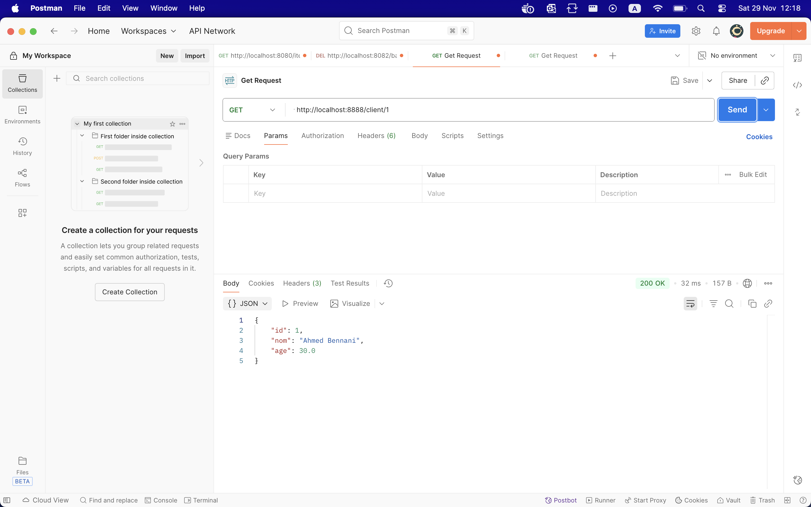
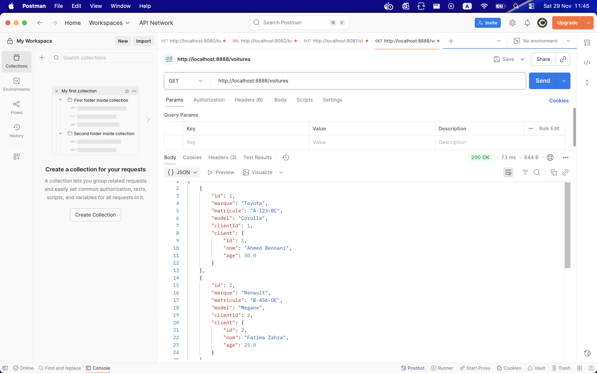

# Spring Cloud Microservices - Eureka, Gateway & OpenFeign

Architecture microservices complète avec Spring Cloud incluant Eureka Server pour la découverte de services, Spring Cloud Gateway comme point d'entrée unique, et OpenFeign pour la communication inter-services.


## Composants

### 1. Eureka Server (Port 8761)
- Registre de découverte de services
- Dashboard: http://localhost:8761

### 2. Service Client (Port 8088)
- Microservice de gestion des clients
- API REST CRUD pour les clients
- Base H2 en mémoire
- Endpoints:
  - GET /clients - Liste tous les clients
  - GET /client/{id} - Récupère un client par ID
  - POST /client - Crée un nouveau client
  - PUT /client/{id} - Met à jour un client
  - DELETE /client/{id} - Supprime un client

### 3. Service Voiture (Port 8089)
- Microservice de gestion des voitures
- Utilise OpenFeign pour communiquer avec Service Client
- Base H2 en mémoire
- Endpoints:
  - GET /voitures - Liste toutes les voitures (avec infos client)
  - GET /voiture/{id} - Récupère une voiture par ID
  - GET /voitures/client/{clientId} - Liste les voitures d'un client
  - POST /voiture - Crée une nouvelle voiture
  - PUT /voiture/{id} - Met à jour une voiture
  - DELETE /voiture/{id} - Supprime une voiture

### 4. API Gateway (Port 8888)
- Point d'entrée unique pour tous les microservices
- Routage automatique et manuel
- Load balancing
- Routes configurées:
  - /clients/** → SERVICE-CLIENT
  - /client/** → SERVICE-CLIENT
  - /voitures/** → SERVICE-VOITURE
  - /voiture/** → SERVICE-VOITURE

## Démarrage

### 1. Build du projet
```bash
mvn clean install
```

### 2. Démarrer les services (dans cet ordre)

#### Démarrer Eureka Server
```bash
cd eureka-server
mvn spring-boot:run
```
Attendre que Eureka soit complètement démarré (Dashboard accessible sur http://localhost:8761)

#### Démarrer Service Client
```bash
cd service-client
mvn spring-boot:run
```

#### Démarrer Service Voiture
```bash
cd service-voiture
mvn spring-boot:run
```

#### Démarrer API Gateway
```bash
cd gateway
mvn spring-boot:run
```

## Tests

### Via Gateway (Recommandé)

#### Tester Service Client via Gateway
```bash
# Lister tous les clients
curl http://localhost:8888/clients


# Récupérer un client spécifique
curl http://localhost:8888/client/1


#### Tester Service Voiture via Gateway
```bash
# Lister toutes les voitures (avec infos client via OpenFeign)
curl http://localhost:8888/voitures

# Récupérer une voiture spécifique
curl http://localhost:8888/voiture/1

# Lister les voitures d'un client
curl http://localhost:8888/voitures/client/1


## Données de test

### Clients (3 clients insérés au démarrage)
1. Ahmed Bennani (30 ans)
2. Fatima Zahra (25 ans)
3. Youssef Alami (35 ans)

### Voitures (4 voitures insérées au démarrage)
1. Toyota Corolla - Client 1 (Ahmed)
2. Renault Megane - Client 2 (Fatima)
3. Peugeot 308 - Client 1 (Ahmed)
4. Mercedes Classe A - Client 3 (Youssef)

## Monitoring

### Eureka Dashboard
http://localhost:8761

### H2 Console - Service Client
http://localhost:8088/h2-console
- JDBC URL: jdbc:h2:mem:client-db
- Username: sa
- Password: (vide)

### H2 Console - Service Voiture
http://localhost:8089/h2-console
- JDBC URL: jdbc:h2:mem:voiture-db
- Username: sa
- Password: (vide)

### Actuator Endpoints
- Gateway: http://localhost:8888/actuator
- Service Client: http://localhost:8088/actuator
- Service Voiture: http://localhost:8089/actuator

## Screenshots

### Eureka Server Dashboard


### Liste des Clients


### Détails d'un Client


### Liste des Voitures


## Technologies utilisées

- Spring Boot 3.2.0
- Spring Cloud 2023.0.0
- Spring Cloud Netflix Eureka
- Spring Cloud Gateway
- Spring Cloud OpenFeign
- Spring Data JPA
- H2 Database
- Lombok
- Maven

## Démonstration de OpenFeign

OpenFeign est démontré dans le Service Voiture qui appelle le Service Client pour récupérer les informations du propriétaire d'une voiture:

```java
@FeignClient(name = "SERVICE-CLIENT")
public interface ClientRestClient {
    @GetMapping("/client/{id}")
    Client findClientById(@PathVariable Long id);
}
```

Lorsque vous appelez `/voitures`, le Service Voiture utilise automatiquement OpenFeign pour enrichir chaque voiture avec les données de son client, en appelant le Service Client via Eureka (découverte de service) et le load balancer.
